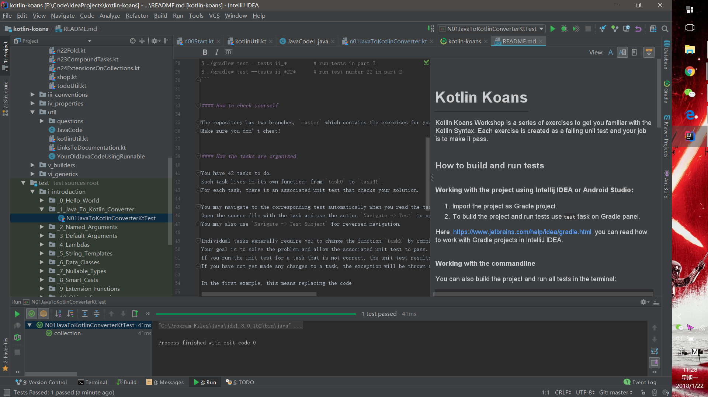
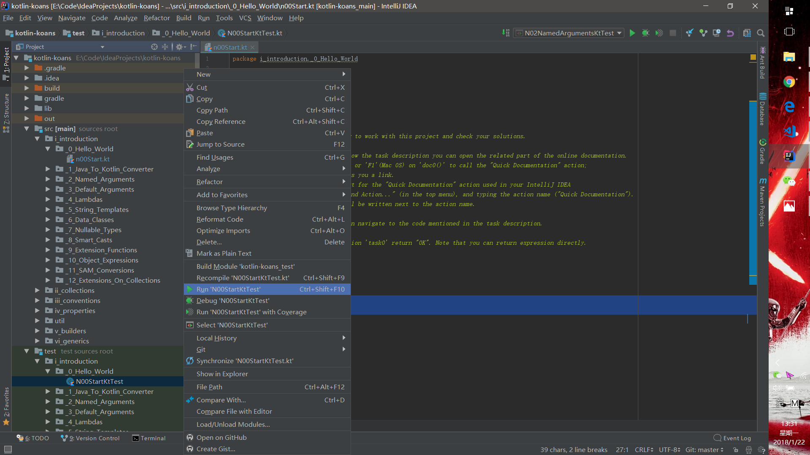
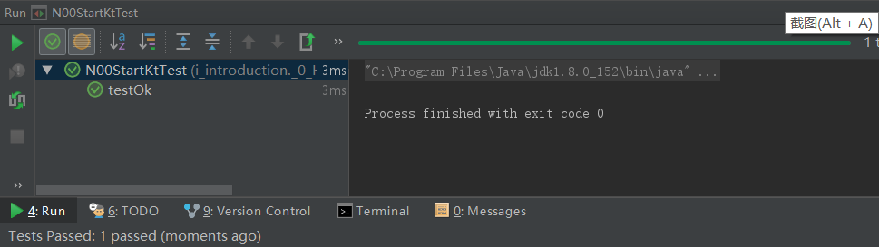

## 什么是kotlin-koans

今天开始学习学习Kotlin，学习的方式是看书——《Kotlin实战（Kotlin in Action）》然后在[kotlin-koans](https://github.com/Kotlin/kotlin-koans)进行练习。至于什么是kotlin-koans，这是其Github上的描述：

> Kotlin Koans Workshop is a series of exercises to get you familiar with the Kotlin Syntax. Each exercise is created as a failing unit test and your job is to make it pass.

大概的意思就是说这是Kotlin官方推出的一系列Kotlin语法练习。一共42个任务，分为6个模块。每一个任务都有一系列单元测试，需要完成的任务就是编码通过单元测试。接下来会把完成完成「kotlin-koans」练习过程中将相关语法点做一个简单的记录。大概每个模块总结成一片文章吧。

<!-- more -->

## 怎么用kotlin-koans

我首先把[kotlin-koans](https://github.com/Kotlin/kotlin-koans)在Github的项目上给fork到我的仓库然后再将其在Idea上git下来。也可以直接把原本的仓库的给git下来。


git下来后用Idea打开，项目的目录长这样：


### _0_Hello_World


和所有其他语言一样，「kotlin-koans」的第一个任务名称就是Hello World，这个任务比较简单，提示也说的很清楚，就是要求task0函数返回一个字符串OK：

```
fun task0(): String {
    return "OK"
}
```

这一个任务主要涉及kotlin的函数定义。在kotlin中函数通过关键字fun声明，和Java中函数的返回类型写在函数名称前不一样，Kotlin中函数的返回类型在函数名称的后面，中间以:分开。Kotlin中的函数总是返回一个值，如果不指定返回值的类型，默认返回Uint（类似Java中的Void）。如果函数体就是一个简单的语句，可以去掉大括弧，用等号表示：

```
fun task0(): String = "OK"
//或
//  fun task0() = "OK"  //Resulutions
```

同时第一个任务也有提示在README.md上有教你怎么run,其实==虽然我也是百度了才懂的：







答案在Github库里的另一个branch

就这样第一个任务Hello World就做完了~

## 其他

如果不想在编译器上练习的话也可以在在线练习:[TRY ONLINE](https://try.kotlinlang.org/)。

这篇文章也参考了很多一篇简书的内容：[Kotlin Koans学习笔记(1)](https://www.jianshu.com/p/5ff8d26bc391?from=jiantop.com)。

下一篇开始更新第一模块i_introduction的13个任务。